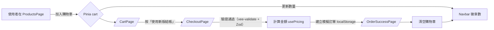

## Analytics 可選配置（GA4 / Sentry）

本專案預設不啟用分析與錯誤回報；只有在設定環境變數時才會載入：

1. 建立 .env.local（不提交版本庫），加入以下任意一項或兩項：

VITE_GA_ID=G-XXXXXXXXXX
VITE_SENTRY_DSN=https://<key>@sentry.io/<project>

2. 本地啟動/建置時不需要這些變數，缺少時不會報錯；在 src/analytics/index.js 中會檢查是否有值，再決定是否載入 GA4 與 Sentry。

3. 事件與頁面檢視

- GA4：透過 dataLayer 推送簡單 pageview（router.afterEach）
- Sentry：以低採樣率 tracesSampleRate: 0.1 啟用（可自行調整）

建議：生產環境再配置，將 .env.production 帶入部署平台的秘密變數中。

---

## CI 鎖檔同步（npm ci 失敗排查）

CI 以 npm ci 安裝依賴時，要求 package.json 與 package-lock.json 完全一致；若你在本地新增/移除套件但沒有提交更新後的 package-lock.json，就會出現下列錯誤：

`npm ci can only install packages when your package.json and package-lock.json are in sync...`

解法（在本地修正後推送）：

1. 確保沒有未提交更動
2. 執行 npm install（會更新 package-lock.json）
3. 提交 package-lock.json 與任何依賴變更
4. CI 重新跑 npm ci 應能成功

補充：若希望 CI 跳過 devDependencies，可改用 `npm ci --omit=dev`，但本專案預設仍需要 devDependencies（測試、建置），建議保持預設。

# 日式電商 Demo

[](https://github.com/AtayalLin/Vueshop-Side-Project-Demo-/actions/workflows/deploy.yml)

- 線上網站（GitHub Pages）：https://atayallin.github.io/Vueshop-Side-Project-Demo-/
- 技術棧：Vue 3 + Vite + Pinia + Vue Router + AOS + GitHub Actions
- 功能：登入 / 登出、註冊、購物車（加入、清單、總計）

## 本機開發

```bash
npm ci
npm run dev
```

## 部署

推送到 main 會自動部署到 GitHub Pages，Action 檔：.github/workflows/deploy.yml

## 專案結構（重點）

```
src/
  api/                 # axios 客戶端與攔截器（集中錯誤處理、讀取 token）
  assets/              # 靜態資源（圖片、樣式覆寫）
  components/          # 可重用元件（Navbar、ProductCard、CartItem...）
  composables/         # 可重用邏輯（usePricing：小計/運費/折扣/總額）
  features/
    checkout/          # 新結帳流程（隔離開發）
      CheckoutPage.vue
      OrderSuccessPage.vue
  pages/               # 一般頁面（Home/Products/Gallery/Cart）
  router/              # 路由設定（含 /checkout 與 /order-success）
  stores/ or store/    # Pinia（auth、cart）
  style.css            # 全域樣式（Design Tokens、RWD 基礎）
App.vue                # App 殼層（Navbar + router-view）
main.js                # 入口檔（Pinia、Router、AOS、Toast）
```

設計原則：增量、低耦合、可測試

- 新功能放在 features/ 下，避免影響既有頁面
- api/ 與 composables/ 與 UI 解耦，利於單元測試與替換
- Router 僅新增路由，不改舊頁面行為

## 主流程圖（加入 → 購物車 → 結帳 → 成功）



說明：

- usePricing 提供小計/運費/折扣/總額計算
- Checkout 使用表單驗證（vee-validate + Zod），送出後寫入 localStorage 並清空購物車
- Navbar 徽章數從 Pinia cart 取得，桌面與抽屜選單都會顯示

## 測試用折扣碼（Demo）

- SAVE100：立減 100 元
- SAVE10：九折（10% off）
- FREESHIP：免運（運費變 0）

使用方式：在 Checkout 頁面的「訂單摘要」輸入折扣碼即可生效（免運會直接把運費顯示為 0）。

## 訂單列表（Orders）

- 成功結帳後會將訂單寫入瀏覽器 localStorage
- 可到 /orders 查看最近訂單摘要（訂單編號、時間、品項數、金額）

---

以下為 Vite Template 說明：

# Vue 3 + Vite

This template should help get you started developing with Vue 3 in Vite. The template uses Vue 3 `<script setup>` SFCs, check out the [script setup docs](https://v3.vuejs.org/api/sfc-script-setup.html#sfc-script-setup) to learn more.

Learn more about IDE Support for Vue in the [Vue Docs Scaling up Guide](https://vuejs.org/guide/scaling-up/tooling.html#ide-support).
